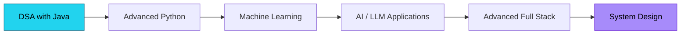
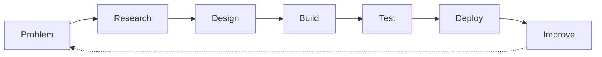

<!-- HEADER BANNER -->
<p align="center">
  
</p>

<!-- TYPING ANIMATION -->
<p align="center">
  
</p>

<p align="center">
  
  
  
</p>

---

## 🌐 Connect With Me

<p align="center">
  <a href="https://github.com/Patilhimanshu99">
    
  </a>
  &nbsp;
  <a href="YOUR_LINKEDIN_URL">
    
  </a>
  &nbsp;
  <a href="mailto:YOUR_EMAIL">
    
  </a>
</p>

---

## 🎯 About Me

```typescript
const himanshu = {
    role: "B.E. AI & Data Science (3rd Year)",
    location: "Pune, Maharashtra, India",

    building: [
        "AI Powered Systems",
        "Full Stack Web Applications",
        "Data Driven Projects"
    ],

    learning: [
        "Python & Machine Learning",
        "DSA with Java",
        "Advanced MERN",
        "AI & LLM Applications",
        "System Design"
    ],

    philosophy: "Build things that actually work."
};
```

---

## 🛠️ Tech Arsenal

<table align="center">
<tr>
<td width="50%" align="center" valign="top">

### 💻 Languages


<br><br>

### 🌐 Frontend


<br><br>

### ⚙️ Backend & APIs

<br>


</td>
<td width="50%" align="center" valign="top">

### 🤖 AI / ML & Data Science

<br>


<br><br>

### 🗄️ Databases

<br>


<br><br>

### ☁️ Tools & Deployment


</td>
</tr>
</table>

---

## 🔥 Featured Projects

<table>
<tr>
<td width="50%" valign="top">

### 📱 SocialeX
**Full Stack Social Media Platform**

A MERN-based social app with real-time features.


- 🔐 User authentication
- 📝 Posts, likes & comments
- 👥 Follow / unfollow
- 💬 Real-time messaging
- 🔔 Notifications & post sharing
- 👤 User profiles

<a href="https://github.com/Patilhimanshu99/Sociale-X-Project">
  
</a>

</td>
<td width="50%" valign="top">

### 🌊 Flood-Guard-AI
**Flood-aware route planning & emergency decision support**

An AI/data-driven project using graph-based routing on OpenStreetMap data.


- 🗺️ Graph-based safe routing
- 🌐 OpenStreetMap data
- ⚡ FastAPI REST backend
- 🚨 Emergency decision support

<a href="https://github.com/Patilhimanshu99/Flood-Guard-AI">
  
</a>

</td>
</tr>
</table>

### 📌 Pinned Repositories

<p align="center">
  <a href="https://github.com/Patilhimanshu99/Sociale-X-Project">
    
  </a>
  <a href="https://github.com/Patilhimanshu99/Flood-Guard-AI">
    
  </a>
</p>

---

## 📚 Learning Roadmap



> Focusing on strengthening fundamentals rather than simply collecting technologies.

---

## 🏗️ Development Approach



---

## 💡 Areas of Interest

| Area | Focus |
|---|---|
| 🤖 **Artificial Intelligence** | AI applications, ML, LLMs |
| 📊 **Data Science** | Data analysis, visualization, ML |
| 🌐 **Full Stack** | MERN, APIs, real-time applications |
| 🧠 **DSA** | Problem solving with Java |
| ☁️ **Deployment** | APIs, web apps & cloud |
| 🚀 **Projects** | Real-world problem solving |

---

## 📊 GitHub Analytics

<p align="center">
  
  
</p>

<p align="center">
  
</p>

<p align="center">
  
</p>

<p align="center">
  
  
</p>

<p align="center">
  
  
</p>

## 🏆 GitHub Trophies

<p align="center">
  
</p>

## 📈 Contribution Graph

<p align="center">
  
</p>

<!-- Snake animation: needs the snake GitHub Action (see setup note) -->
<p align="center">
  <picture>
    <source media="(prefers-color-scheme: dark)" srcset="https://raw.githubusercontent.com/Patilhimanshu99/Patilhimanshu99/output/github-contribution-grid-snake-dark.svg">
    <source media="(prefers-color-scheme: light)" srcset="https://raw.githubusercontent.com/Patilhimanshu99/Patilhimanshu99/output/github-contribution-grid-snake.svg">
    
  </picture>
</p>

---

## 🌱 Open Source & Collaboration

I'm interested in collaborating on:

- 🤖 AI / ML projects
- 📊 Data Science projects
- 🌐 MERN applications
- 🔓 Open-source projects
- 🎓 Student developer projects
- 🌍 Real-world problem-solving projects

If you're building something interesting, feel free to connect.

---

<p align="center">
  <i>"I don't want to just learn technologies — I want to build something useful with them."</i>
</p>

<p align="center">
  <b>Learn → Build → Break → Fix → Improve → Repeat.</b> 🚀
</p>

<p align="center">
  
</p>
